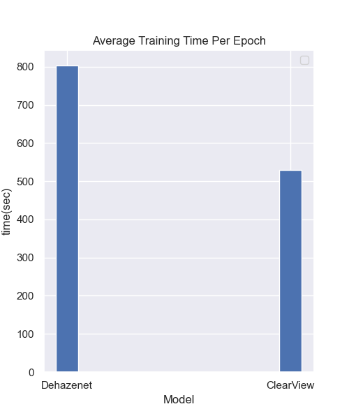
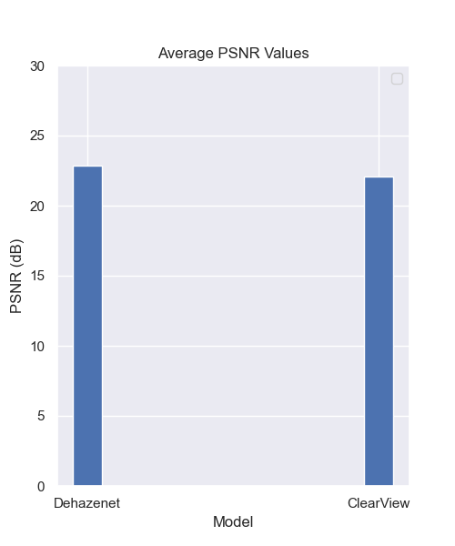
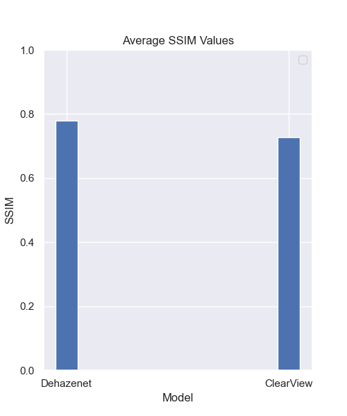
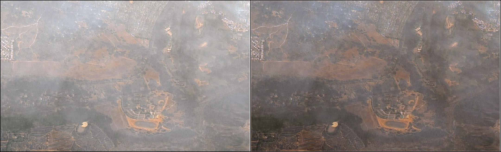
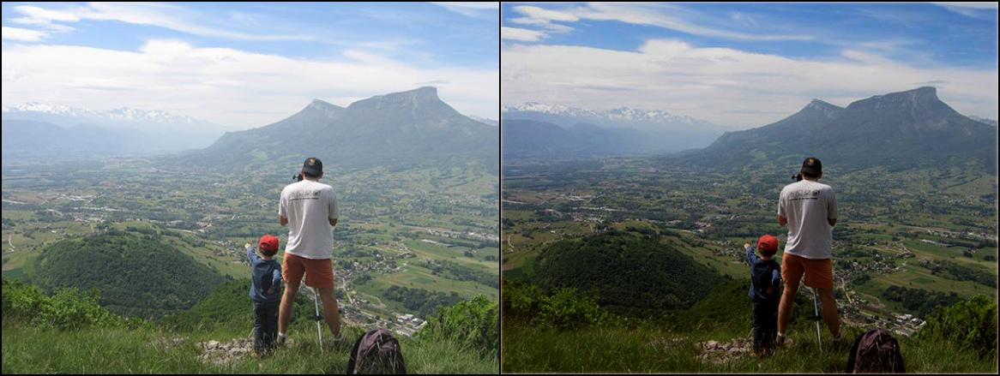
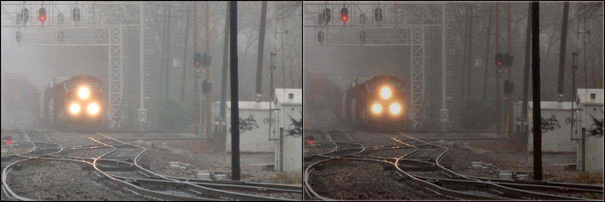
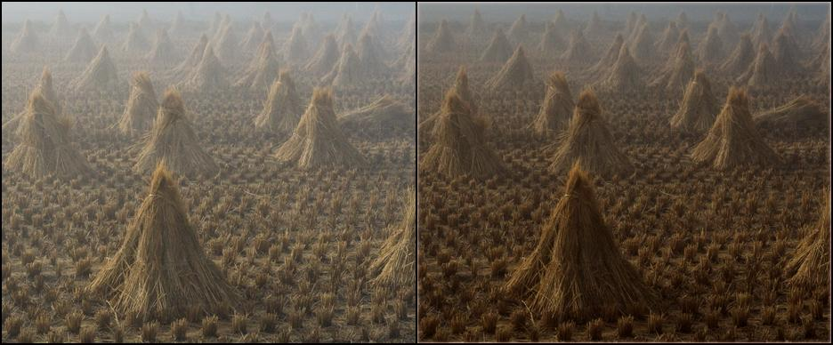

# ClearView - Tackling Dehazing Challenges

### Authors : Rohit Shroth, Savinay Shukla (ss16924)

Lightweight De-Hazification model with 1800 trainable params and 8MiB in size.

Our approach employs depth-wise separable convolutional layers and self-regularized activation functions to effectively clean hazy images and can be integrated with segmentation models for enhanced performance. We believe that our approach will be particularly useful for memory-
bound systems already confined by heavy segmentation models when dealing with obscured environments. Our benchmark results based on SSIM and PSNR scores demonstrate that our modified architecture achieves performance on par with the DehazeNet model while having a smaller overall memory footprint. This makes our approach a promising solution for memory-bound autonomous systems that use computer vision in obscured environments, as it offers efficient and effective dehazing capabilities with reduced computational requirements.

# Instruction

**Dataset** - https://drive.google.com/file/d/1OpokedZ9o-RP7n8Vb3CBjX2yZm-E2Qb2/view?usp=share_link

Download the dataset and extract in the project’s directory, before running the experiment. This will create a data folder.

1. `driver.py` is the start point of execution
2. It takes in multiple args
```
python3 driver.py \
    --og_img=data/original/ \
    --hazy_img=data/haze/ \
    --lr=0.0004 \
    --weight_decay=0.0001 \
    --grad_clip_norm=0.1 \
    --num_epochs=10 \
    --train_batch=8 \
    --val_batch=8 \
    --num_workers=4 \
    --snapshots_folder=snapshots/ \
    --model=clearview \
    --run_id=clearview \
    --logs=logs/
```
3. Inorder to run "clearview" model use option `--model=clearview` else `--model=dehaze` for DehazeNet
4. Use `examples.ipynb` to visualize various results

>Note: The training process outputs `Run logs in logs folder` and the model- `clearview.pth` in snapshots folder.

# Analysis

Due to reduced complexity of our implementation (using depth-wise convolutional layers) we were able to achieve faster training times when compared to the Dehazenet architecture.

|  | 
|:--:| 
| Average Training Time Comparision |


Additionally, our PSNR and SSIM scores are on par with the Dehazenet scores.

|  |  | 
|:--:|:--:|
| PSNR Comparision| SSIM Comparision |

# Sample images from real-world instances.

Original Hazy images on the left, and cleaned images from our model on the right.




